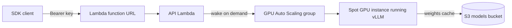

# RightPeople SDK

Monorepo for the RightPeople OpenAI-compatible API and its client libraries.

| Path | What it is |
| --- | --- |
| `apps/api` | Hono reference API (`/v1/models`, `/v1/chat/completions`, `/v1/embeddings`). Runs on Node locally and on AWS Lambda in production. |
| `openapi/openapi.json` | Spec generated from `apps/api`. Source of truth for every SDK. |
| `packages/sdk` | `@itsmehul/sdk` TypeScript client |
| `packages/ai-sdk-provider` | `@itsmehul/ai-sdk-provider` for the Vercel AI SDK |
| `packages/langchain` | `@itsmehul/langchain` |
| `python/rightpeople` | `rightpeople` Python client |
| `python/langchain-rightpeople` | `langchain-rightpeople` |
| `examples` | TypeScript and Python examples that call the API through each package |
| `infra/terraform` | Production infrastructure: Lambda API and a scale-to-zero spot GPU running vLLM |

## Requirements

- Node.js 22 or newer
- pnpm (version pinned in `package.json` under `packageManager`)
- [uv](https://docs.astral.sh/uv/) for the Python packages (Python 3.10 or newer)
- [Ollama](https://ollama.com) for real model responses locally (optional)
- Terraform 1.10 or newer and AWS credentials, for production only

## Local development

### 1. Install

```sh
pnpm install
uv sync --directory python
cp .env.example .env
```

### 2. Choose an inference backend

The API forwards chat and embedding requests to any OpenAI-compatible server set by `INFERENCE_BASE_URL`.

**Ollama (real models):**

```sh
ollama pull tinyllama
ollama pull nomic-embed-text:v1.5
ollama serve
```

**Echo engine (no models):** set `RIGHTPEOPLE_ENGINE=echo` in `.env`. Responses are deterministic, which is what the tests use.

### 3. Start the API

```sh
pnpm dev
```

The API listens on `http://localhost:8787`. Interactive docs are at `/docs`, the spec at `/openapi.json`, and a health check at `/health`.

### 4. Everything else

All other tasks run through one interactive menu:

```sh
pnpm cli
```

It first reports what is missing (`.env`, generated types, build output, Python venv, Terraform backend), then offers these groups:

| Group | Tasks |
| --- | --- |
| Codegen | Regenerate `openapi/openapi.json`, the TypeScript types and the Python models from `apps/api` |
| Quality | Build, test, typecheck, lint, lint and fix, check published packages |
| Examples | Run each TypeScript and Python example against the local API |
| Python | Install deps, test, typecheck, lint, format, build wheels |
| Deploy | Bundle the Lambda and run Terraform (see below) |
| Release | Add a changeset, view release status, version packages |

A typical first run is Codegen, then Quality → Build, then any example while `pnpm dev` is running.

### Environment variables

| Variable | Purpose | Default |
| --- | --- | --- |
| `RIGHTPEOPLE_API_KEY` | Key the local API accepts and the SDKs send. If empty, the API accepts any bearer token. | `sk-local-dev` |
| `RIGHTPEOPLE_BASE_URL` | Where the SDKs and examples send requests | `http://localhost:8787/v1` |
| `PORT` | Local API port | `8787` |
| `INFERENCE_BASE_URL` | OpenAI-compatible backend | `http://localhost:11434/v1` |
| `INFERENCE_API_KEY` | Bearer token for the backend, if it needs one | unset |
| `CHAT_MODEL` | Backend model behind `rightpeople-beta` | `tinyllama` |
| `EMBED_MODEL` | Backend model behind `rightpeople-embed` | `nomic-embed-text:v1.5` |
| `RIGHTPEOPLE_ENGINE` | Set to `echo` to skip the backend | unset |

### Changing the API

The spec and generated SDK types are checked into the repo, and CI fails if they drift. After editing routes or schemas in `apps/api`, run Codegen from `pnpm cli` and commit the updated `openapi/`, `packages/sdk/src/generated/` and `python/rightpeople/src/rightpeople/_generated/`.

## Production



- **API:** `apps/api` bundled to `apps/api/dist/lambda/index.mjs` and deployed as a Node 22 arm64 Lambda behind a streaming function URL. API keys are stored in SSM Parameter Store.
- **Inference:** an Auto Scaling group (minimum 0, maximum 1) of spot `g4dn.xlarge` instances running vLLM. Chat is served on port 8000 and embeddings on port 8001. Model weights are cached in S3 after the first boot.
- **Scale to zero:** when no GPU instance is running, the API raises the group to one and returns `503 model_loading` with a `retry-after` header until vLLM is healthy. The instance terminates itself after `idle_minutes` (default 15) without requests. The first request after an idle period therefore takes several minutes.

### First deploy

1. Create an S3 bucket for Terraform state:

   ```sh
   aws s3 mb s3://rightpeople-terraform-state-<account-id> --region us-east-1
   ```

2. Copy `infra/terraform/envs/prod/backend.hcl.example` to `backend.hcl` in the same folder and fill in the bucket name.
3. Run `pnpm cli`, choose **Deploy**, then:
   - **Terraform init**
   - **Plan** to review the changes (bundles the Lambda first)
   - **Deploy** to apply (bundles the Lambda first)
4. Choose **Outputs** to get `api_base_url`, then read the generated key:

   ```sh
   terraform -chdir=infra/terraform/envs/prod output -raw api_key
   ```

5. Point the SDKs at production:

   ```sh
   export RIGHTPEOPLE_BASE_URL=<api_base_url>
   export RIGHTPEOPLE_API_KEY=<api_key>
   ```

To ship API changes later, run **Deploy** again. Use **Destroy** to tear everything down.

### Configuration

Override these in `infra/terraform/envs/prod` with a `terraform.tfvars` file or `-var` flags:

| Variable | Default |
| --- | --- |
| `region` | `us-east-1` |
| `az_count` | `2` (more zones give a wider pool of spot capacity) |
| `gpu_instance_types` | `["g4dn.xlarge"]` (`g6.xlarge` is a good fallback) |
| `use_spot` | `true` |
| `vllm_version` | `0.10.2` |
| `chat_model` | `Qwen/Qwen2.5-1.5B-Instruct` |
| `chat_max_model_len` | `4096` |
| `embed_model` | `nomic-ai/nomic-embed-text-v1.5` |
| `idle_minutes` | `15` |

### Troubleshooting

- Lambda logs are in the CloudWatch log group `/aws/lambda/rightpeople-api`.
- GPU boot logs are at `/var/log/rightpeople-boot.log` on the instance. Connect with SSM Session Manager; no SSH key is configured.
- vLLM runs as the systemd units `vllm-chat` and `vllm-embed`.

## Releasing

- **npm:** add a changeset with `pnpm cli` (Release → Add changeset) in your PR. On merge to `main`, the Release workflow opens a version PR. Merging that PR publishes to npm with provenance. Requires the `NPM_TOKEN` secret.
- **PyPI:** push a tag matching `python-v*` (for example `python-v0.2.0`). The Release Python workflow tests, builds and publishes through trusted publishing in the `pypi` environment.

CI runs on every pull request. It runs Biome and Ruff, checks that the spec and generated types are up to date, then builds, typechecks and tests on Node 22 and 24 and on Python 3.10 through 3.13.
